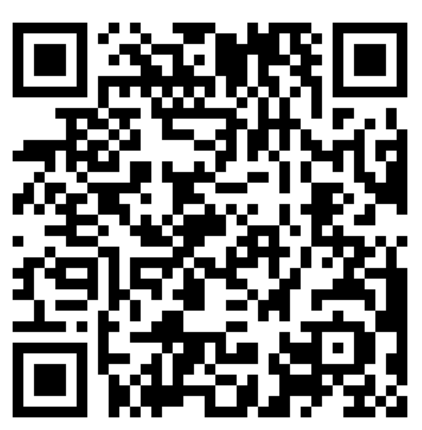
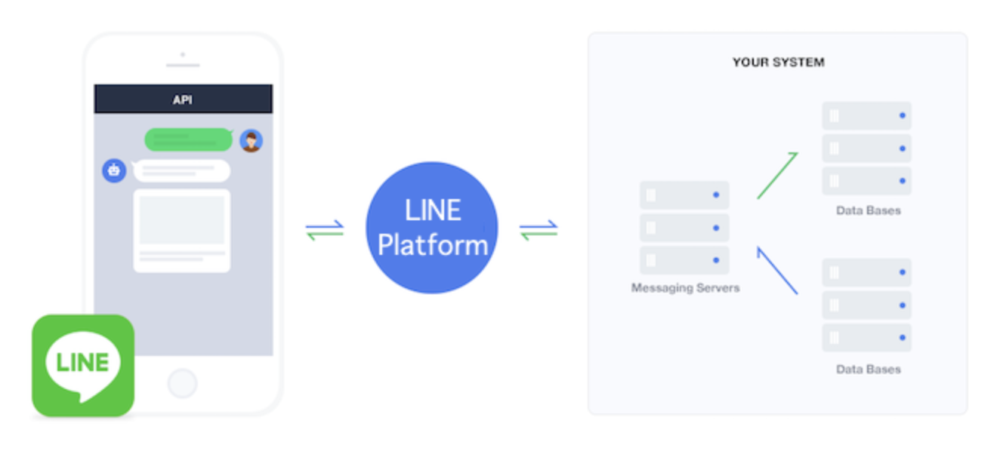

# 筆記

## QR code
Line ID @327lmcvf<br>



## Line Message API
### 運作方式

使用https資料型態為json


## 
- [x] 要能做到在line發送訊息時 server能依照發送的訊息做不同的處理
- [x] 能主動從server發送訊息給user(推播)
- [ ] 訂閱通知

# 功能

## 關鍵字

### 註冊關鍵字

說明：會將註冊關鍵字到個人記錄裡，之後每當使用者輸入關鍵字，會顯示公車到站資訊。<br>

語法：註冊 keyword station bus1(optional),...<br>

範例1：<code>[註冊] 回家 三民國中</code> 顯示三民國中所有公車到站<br>

範例2：<code>[註冊] 回家 三民國中 630,617,645</code> 顯示三民國中 630、617、645到站資訊<br>

顯示結果：
```
630：預估9分44秒到達三民國中 
617：預估14分38秒到達三民國中 
645：預估1分47秒到達三民國中
```

若要在已註冊的關鍵字新增公車只要在輸入欲新增的公車即可<br>

<code>[註冊] 回家 三民國中 紅32</code><br>

這樣輸入回家時 就會顯示三民國中 630、617、645、紅32的到站資訊<br>

若要取消公車則請參考下方取消關鍵字刪除該關鍵字在重新創立

!!!特殊狀況!!!

若該場站不只一個方向，則會跳出第二階段訊息詢問是哪個方向

機器人會詢問：<code>您輸入的三民國中有多個方向請問是哪一個方向？ 1207-三民國中(向東)、5020-三民國中(向西) 請依格式輸入[註冊] ${id}。</code>

需要使用者近一步輸入才能準確設定到站提示，例如我們需要的是三民國中(向東)這方向
則在line輸入

<code>[註冊] 1207</code>則會綁定三民國中(向東)這方向

### 取消關鍵字

說明：將已輸入的關鍵字刪除

語法：[刪除] keyword (option)busName...

範例1：<code>[刪除] 回家</code>

說明：刪除該使用者**回家**此關鍵字的**所有公車**到站提示

範例1：<code>[刪除] 上班 630,617</code>

說明：將使用者註冊的關鍵字**上班**中移除630, 617公車到站提示

### 查詢關鍵字

說明：查詢當前個人所有已輸入的關鍵字

語法：查詢關鍵字

範例1：<code>[關鍵字]</code>

顯示結果：

```
關鍵字：回家 場站名稱：三民國中 公車：617,630,645

關鍵字：上班 場站名稱：三民國中 公車：903,民權幹線

關鍵字：上班 場站名稱：上灣仔 公車：藍36
```

## 即時到站通知

說明：短期訂閱(當指定公車即將到達時主動發line通知)

TODO...

### (手機分享地理位置)

說明：顯示附近100公尺的公車車站

TODO...

### 幫助/help

說明：顯示使用說明及github連結

語法：[幫助] or [help]

TODO...


### Reference

[line message api doc](https://developers.line.biz/en/reference/messaging-api/#messages)

[MOTC Transport API](https://ptx.transportdata.tw/MOTC/)

